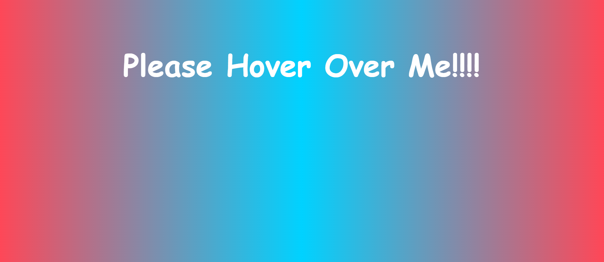
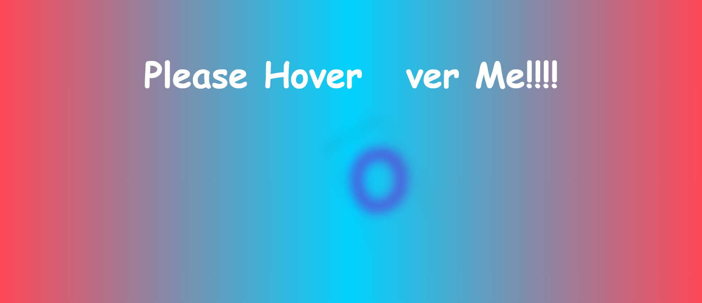

# Hover Text Animation

**Hover Text Animation** is a visually dynamic project that creates a smokey animation effect when text is hovered over. Using a combination of HTML, CSS, and JavaScript, this project transforms text into a beautiful, interactive display. The text animates with a blur effect and colorful transitions as the user hovers over the characters. It's a great way to make any text more engaging and interactive for the user.

## Demo

### Simple Text

This is how the text looks before hovering. A static, unanimated state.

### Hover Effect

This is the effect after hovering over the text. The animation transforms the text with a smokey, colorful blur that moves off the screen.

## Features

- Interactive hover effect with animated text.
- Each letter is individually animated.
- The text transitions with a colorful, smokey blur, creating an engaging effect.
- Responsive design that adapts to different screen sizes.
- Customizable CSS animations and JavaScript functionality.

## How It Works

1. **HTML Structure**: The text is placed inside an HTML element (`<h1>`). Each letter is wrapped in a `` tag dynamically using JavaScript.
2. **CSS Styling**: Styling and animation effects are achieved through CSS. The text animates using `@keyframes` for the smokey blur, rotating effect, and color transition.
3. **JavaScript Interaction**: The JavaScript script wraps each letter of the text in a `` and adds an event listener to trigger the animation when hovered over.

## How to Use

1. Clone or download the repository to your local machine.
2. Open the `index.html` file in your web browser to see the animation in action.
3. Edit the text directly in the `index.html` file to change the content that gets animated.
4. You can also adjust the animation timing and effect by modifying the `style.css` file.

## File Structure

- `index.html`: Contains the HTML structure and content that will be animated.
- `style.css`: The CSS file responsible for the text styling and animation.
- `script.js`: The JavaScript file that controls the hover effect by wrapping each letter in a `` and applying the hover event listener.

## Customization

- **Text Content**: Easily modify the text by editing the content inside the `<h1>` tag in the `index.html` file.
- **Animation**: Adjust the animation speed, blur, rotation, and scale by modifying the `@keyframes smoke` rule in the `style.css` file.
- **Hover Effects**: Change the hover effect duration and style to suit your design preferences by editing the `span.active` styles in `style.css`.
- **Responsive Design**: This design adjusts to different screen sizes, but you can further tweak it in `style.css` for additional responsiveness or mobile-friendliness.

## Use Cases

This animation effect can be applied in various situations:
- **Interactive Text**: Use it for headings, tags, or any interactive text on your webpage to engage users.
- **Buttons**: You can apply this animation to buttons or call-to-action links to make them stand out.
- **Creative Projects**: Add a creative touch to your portfolio or personal website by using this hover effect for a modern and dynamic feel.

## Additional Information

- **Cross-browser Compatibility**: This animation works in most modern browsers, but some older browsers may not fully support the CSS `@keyframes` and `transform` properties. Ensure your project targets modern browsers for optimal results.
- **Performance Considerations**: Since the hover animation involves transformation and scaling, it may affect performance on lower-end devices or when applied to large blocks of text. Test performance on various devices to ensure a smooth user experience.

---

Feel free to fork, clone, and contribute to this project. We encourage you to try different text styles, animations, and effects to see how you can make the hover text even more engaging. Enjoy coding and experimenting!

